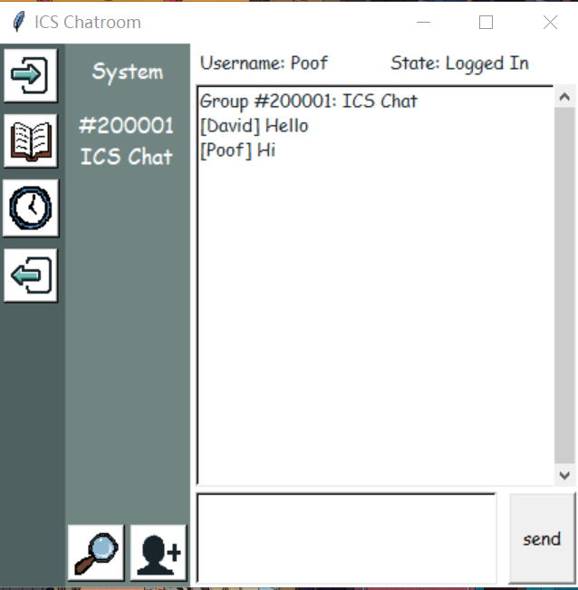
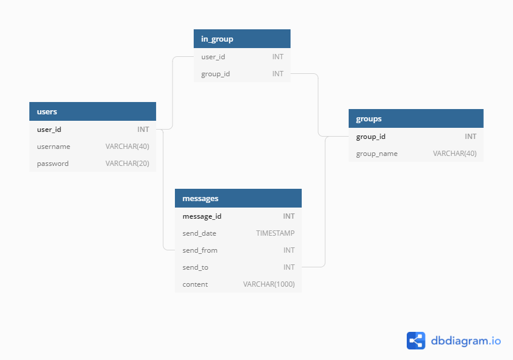

# Simple-Chatroom-ICS-Final-Project

## About

This is the final project for my Intro to Computer Science class. It's a multiclient chat system written in python. 

## Functionality

#### Client

* GUI that is
  * minimalistic
  * user-friendly with graphical widgets
  * resizable

* New user can register your account with a username and a password.
* Users can chat with others by join an existing group or create their own group.
* User can join multiple groups and chat in different groups.
* Save list of groups in the server database and retrieve it when user login next time.
* Search for chat history in the groups a user joined.
* Support chat text of multiple lines.

Below is a screenshot from the client distribution.

  

#### Server

* Database implemented using SQLite that 
  * is light, portable and server-less
  * can manage users actions like login, register, add group, search for chat history

* The database is light, portable and server-less.
* Self-designed protocol for message transmission between server and client.
* Detailed status update information on the command line interface

Below is the diagram of the server database.



### Installation

The executable has been tested under **Windows 10**, Windows 7 should work as well. To run the executable, first unpack the [distribution/Simple_Chatroom.rar](./distribution).

### Dependencies

#### Source code

The source code is written using python 3.8.1 and tested on Win 10 and Mac. 

All modules used in the source code are built-in python modules.

To run the server, use

```
python run_server.py
```

To run the client GUI, use

```
python run_client.py
```

#### Packaged

To package the source code by yourself in Windows 10, you should first install pyinstaller. Then, download the repository, switch working directory to run the following command in cmd.

```
pyinstaller --name "Simple Chatroom" -w --add-data "./res;./res" --icon "./res/chatroom.ico" run_client.py
```


#### 


